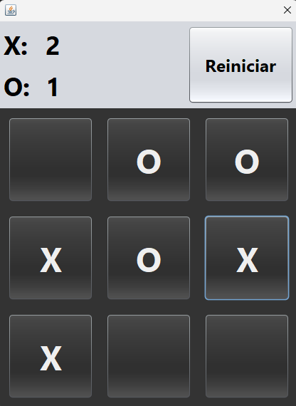

# Tic-Tac-Toe

Implementation of the Tic-Tac-Toe game, built in Java. Developed during my 4th semester at university.

## Screenshots


### Test it!
Clone the repository::
   ```bash
   git clone https://github.com/luizpfern/tictactoe-java.git
